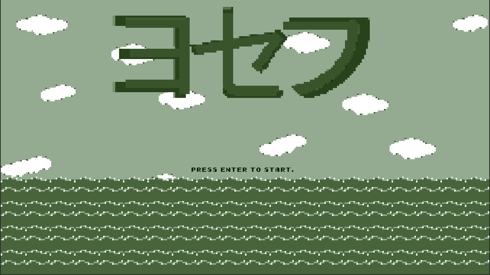
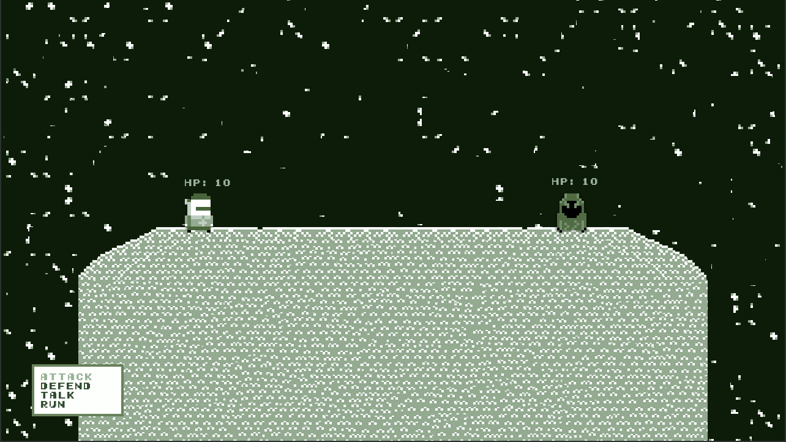

<h1>description</h1>
Small RPG game built using LibGDX framework. 
Most of the work can be found in: 
<a href="https://github.com/JotraN/yosefu/tree/master/core/src/com/yosefu/game">/core/src/com/yosefu/game</a> 

Screenshots: 
 
 

<h1>installation instructions</h1>
To play, download <a href="https://github.com/JotraN/yosefu/raw/master/yosefu.jar">yosefu.jar</a> and run it by either double clicking on it or via command line: 
<code>java -jar yosefu.jar</code> 
You can also build it yourself by importing the project into your preferred IDE. 

<h1>controls</h1>
<strong>wasd/arrow</strong> keys are used to move the player. 
<strong>o</strong> is used to interact/select. 

<h1>creating a level</h1>
Level/map files should be created in <a href="https://github.com/JotraN/yosefu/tree/master/core/assets/levels">/core/assets/levels/</a>. 
Some example files can be found there.  
The first lines (before the actual tile map) consists of information for objects in the map. 
The characters used for each object correspond to those indicated in the Level class (e.g. doors are lowercase letters a-n). 
<em>The following examples are taken from the map_02 file:</em> 
The first line creates a door: 
<code>a:map_01 332 574</code>
<ul>
	<li>The first character <code>a</code> indicates that the object is a door.</li>
	<li>The characters after the <code>:</code> are the variables for that object.</li>
	<li>In this example, <code>map_01 332 574</code> are the variables.</li> 
	<li>Each variable is seperated by a space.</li>
	<li>The first variable declares the map this door leads to.</li>
	<li>The second and third are the x and y coordinates for the player to move to
(after entering the door).</li>
</ul>
The following line creates an enemy: 
<code>o:badguy.png 10 10 1#a:map_01a 332 574</code>
<ul>
	<li>Similar to the door, the first character indicates the object is an enemy.</li>
	<li>Unlike the door, the variables for the enemy is between the <code>:</code> and the <code>#</code>.</li>
	<li>The first variable indicates the texture of the enemy</li>
	<li>The rest indicates the enemy's health, pp, and attack.</li>
	<li>Finally, the <code>#</code> represents an action to be taken upon the enemy's defeat, this portion is optional. 
	In this example, upon the enemy's death, the <code>a</code> door would change its destination from <code>map_01</code> to <code>map_01a</code>.</li>
</ul>

The rest of the file contains the tile map of the level:
<ul>
	<li><code>1</code> indicates a wall.</li>
	<li><code>0</code> indicates empty space.</li>
	<li>A letter indicates the objects created in the first few lines of the file.</li>
</ul>

<h1>notes</h1>
Still requires a lot of work:
<ul>
	<li>A story.</li>
	<li>More battle options.</li>
	<li>More content.</li>
	<li>Inventory system.</li>
	<li>A save system.</li>
	<li>Sounds.</li>
	<li>FPS limiter.</li>
	<li>Endgame screens.</li>
</ul>
